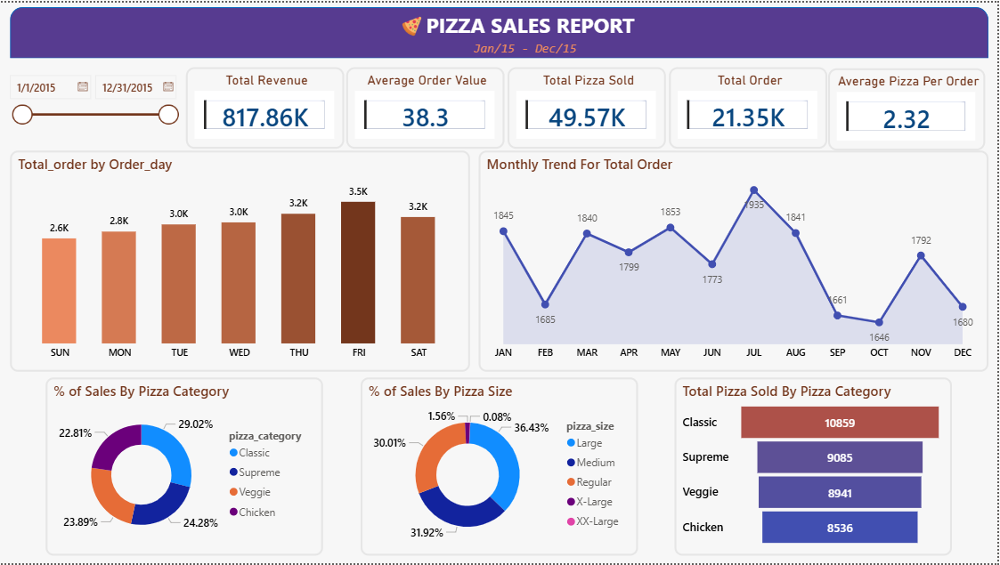

# 🍕 Pizza Sales Dashboard – Power BI Project
---

## 📸 Dashboard Preview


---

## 📊 Project Overview
This Power BI project analyzes pizza sales data to uncover key business insights related to revenue,
order patterns, customer preferences, and product performance over the year 2015.

The dashboard provides an interactive view of sales trends, category-wise performance,
and customer ordering behavior to support data-driven decision-making.

---

## 🛠 Tools & Technologies
- Power BI Desktop
- Excel / CSV Dataset
- SQL (for data preparation & analysis)

---

## 📌 Key KPIs
- **Total Revenue:** 817.86K
- **Total Orders:** 21.35K
- **Total Pizzas Sold:** 49.57K
- **Average Order Value:** 38.3
- **Average Pizzas per Order:** 2.32

---

## 📈 Business Insights

### 🔹 Overall Performance
- The business generated **817.86K in revenue** from **21.35K orders**, indicating strong annual sales.
- Customers order **2.32 pizzas per order on average**, showing a tendency for multi-item purchases.

---

### 🔹 Daily Order Trend
- **Friday** recorded the **highest number of orders**, making it the busiest day of the week.
- **Sunday** had the lowest order volume, suggesting lower weekend-start demand.
- Orders steadily increase from Monday to Friday, indicating strong weekday performance.

---

### 🔹 Monthly Sales Trend
- **July** showed the **highest number of orders**, indicating peak seasonal demand.
- **October and September** experienced the lowest sales, suggesting possible seasonal slowdown.
- Sales remain relatively stable during the first half of the year.

---

### 🔹 Category-wise Sales Contribution
- **Classic pizzas** contribute the highest share of total sales (~29%).
- **Supreme and Veggie** categories perform almost equally, showing balanced customer preferences.
- **Chicken pizzas** have the lowest contribution but still maintain a significant share.

---

### 🔹 Pizza Size Preference
- **Large pizzas** are the most popular, contributing **36.43%** of total sales.
- **Medium and Regular sizes** together account for over **60%**, showing strong mid-size demand.
- **X-Large and XX-Large pizzas** have minimal sales, indicating limited customer preference.

---

## 📊 Dashboard Features
- Dynamic date slicer for time-based analysis
- KPI cards for quick performance overview
- Day-wise and month-wise trend analysis
- Category and size-based sales breakdown
- Interactive visuals for deeper insights

---

## ▶️ How to Run This Project
1. Download the `.pbix` file from the `Dashboard` folder
2. Open it using **Power BI Desktop**
3. Load the dataset from the `Data` folder if prompted
4. Click **Refresh** to view the dashboard

## 📁 Project Structure

```text
├── Dashboard/  
├── Data/             
├── SQL/        
├── Screenshot/      
└── README.md
```
## 🚀 Conclusion
This dashboard provides a clear understanding of pizza sales performance,
helping stakeholders identify peak demand periods, customer preferences,
and opportunities for business optimization using data-driven insights.
